##  Nama :Nahrul Wijaya 
##  Nim  :312010415     
##  Kelas:TI.20.A1      

## Langkah Langkah Praktikum 4

Membuka text editor, Saya menggunakan Sublime text
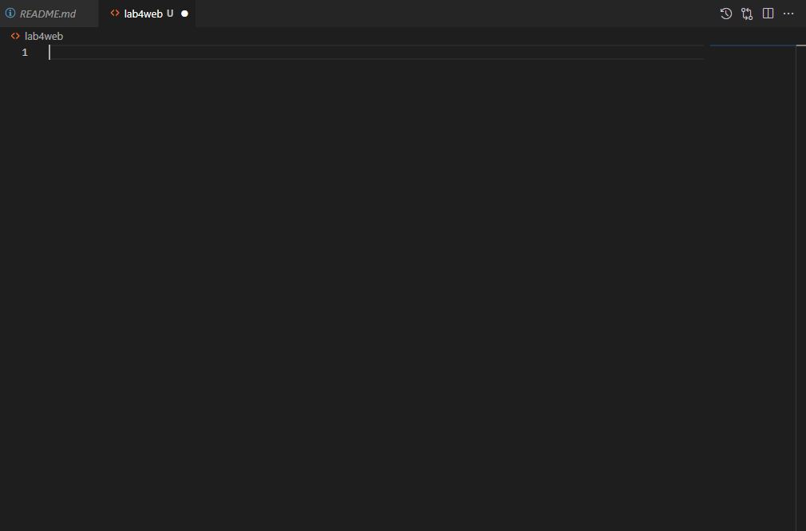

# 1. Membuat Box Element
Tambahkan kode untuk membuat box elemen dengan tag div seperti berikut.
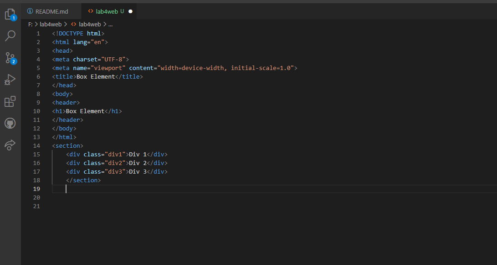

# 2. CSS Float property
Selanjutnya tambahnya deklarasin CSS pada head untuk membuat float element,seperti berikut,kemudian buka browser untuk melihat hasilnya.
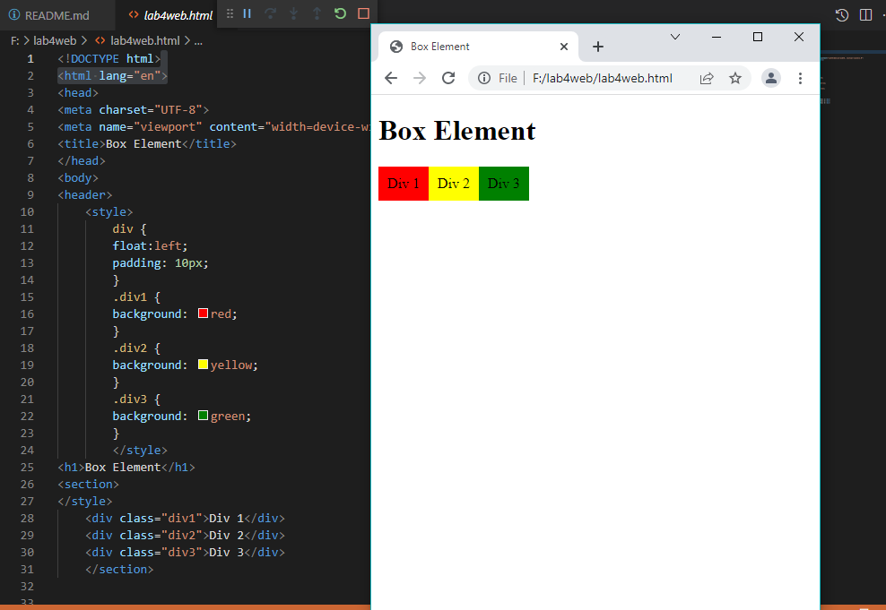

# 3. Mengatur Clearfix Element
Clearfix digunakan untuk mengatur element setelah float element. Property clear digunakan untuk mengaturnya.

Tambahkan element div lainnya setelah div3 seperti berikut.
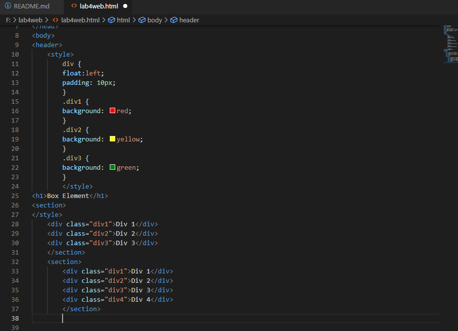

Kemudian atur Proprty Clear pada CSS,seperti berikut.
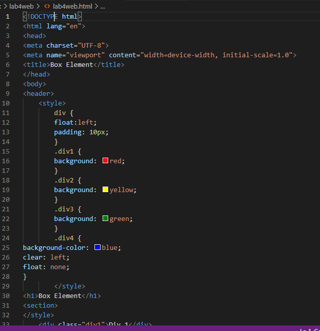

Selanjutnya buka browser dan refresh kembali.
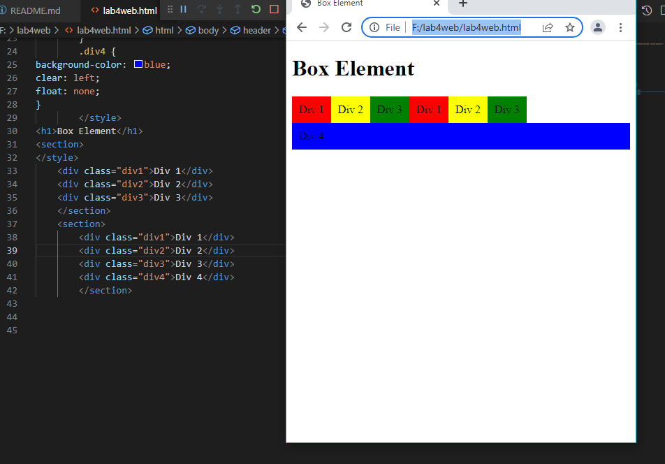

# 4. Membuat Layout Sederhana
Kita akan membuat layout web
sederhana seperti gambar berikut.
(tertera di modul praktikum)

Buat folder baru dengan nama 
lab4_layout,kemudian buatlah file baru
didalamnya dengan nama home,html,dan
file css dengan nama style.css
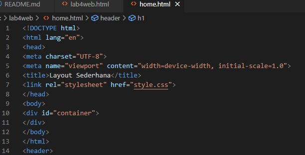

kemudian tulis berikut,lalu buka
browser dan lihat hasilny.
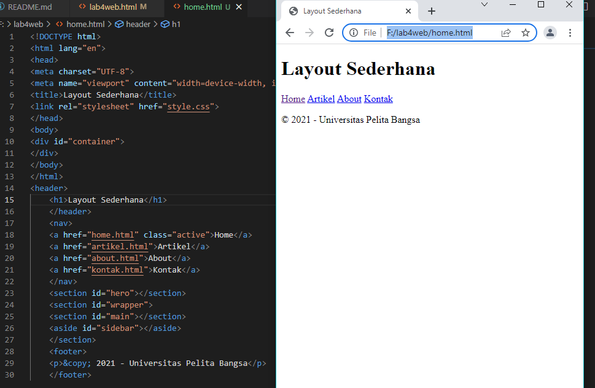

Kemudian tambahkan kode CSS
untuk membuat layoutnya.
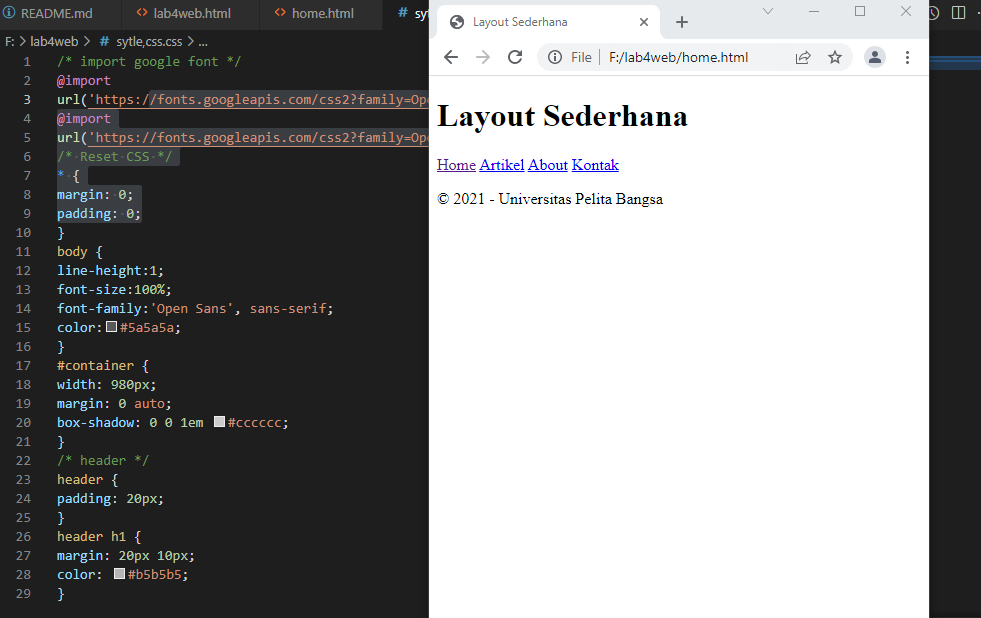

# 5. Membuat Navigasi

Kemudian selanjutnya mengatur
navigasi,lalu hasilnya
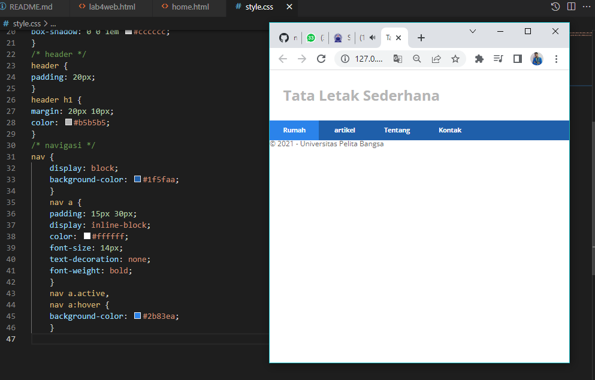

# 6. Membuat Hero Panel

Selanjutnya membuat hero panel.
Tambahkan kode HTML dan CSS seperti berikut
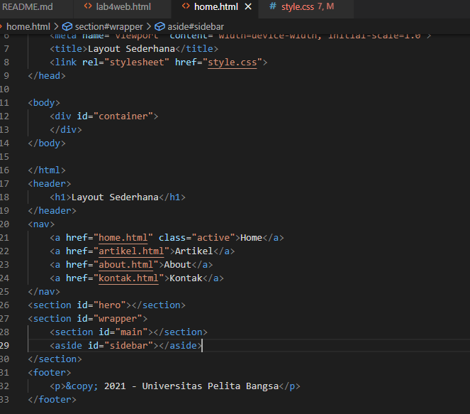

# CSS
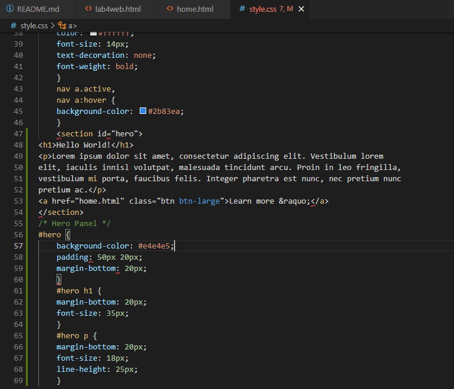

# Hasilnya
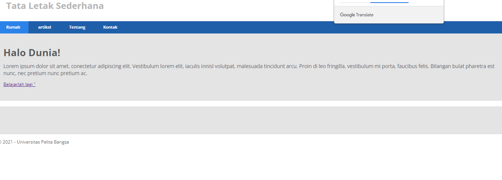
